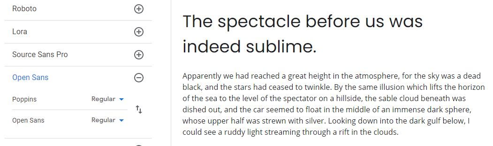
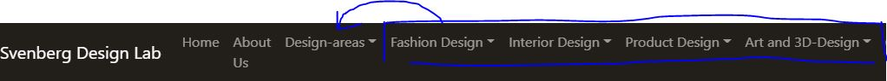
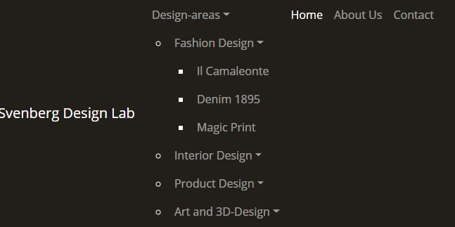
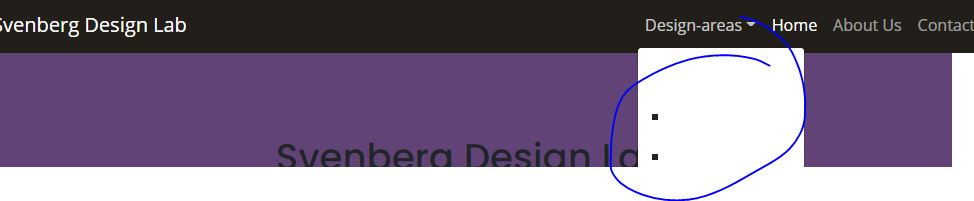
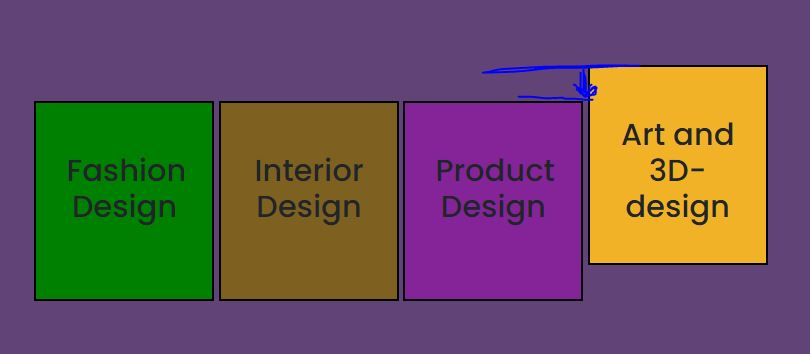

# SVENBERG DESIGN LAB
## Code Institute - Milestone Project 1
This website has been designed to showcase the work of Svenberg Design Lab, and to be a place for prospective customers and collabortors to explore the previous work of the company.
The target audience consists of two groups; the private customer who has a design-wish to be fulfulled, and the professional customer looking for a design-company for collaboration.

Click here to view the website

## User Experience (UX)

### User stories:

### First time visitor goals
To find information about a company I'm curious about. To see their projects and their style. To confirm the quality and trustworthyness of the company.

### Returning visitor goals
To be able to find the project I'm looking for quicly. Perhaps look at different projects and different design-areas than on my first visit. Get a feel for the company as a whole.

### Frequent user goals
To be able to find the project I'm looking for quicly, and to be able to see all projects in each design-area on one page, in order to compare and find what is interesting.

### Site owner goals
To show prospective customers and partners what we do, our style and our high quality. As we work in several different design-areas, it is important that the visitor understands that they are at the right company-site regardless of what area they first have come in contact with. Therefore the different ares must be shown as equals, and not (for instance) primarily interior-design, and the other areas as additions. 
Another important reason behind the site is simply to collect and showcase previous project in one coherent space. 

## Design

### Colour scheme:

### Typography:
Font Poppins for headlines and Open Sans for other text.  
 
Poppins is a straight-forward, easily-approachable font, that is both elegant and simple, and that has rounded shapes that makes it feel trustworthy. We want a font that is elegant, but not old-fashioned, and not too avant-guard. Poppins is just the right mix.  
 
Open Sans works well with Poppins, as it has much of the same overall feeling, a simple, nicely spaced look (not too narrow), and with lovely old-fashioned g's that gives it a nice, comforting feeling.

### Imagery:

## Wireframes

## Features

#### Future features:
- Feedback from previous customers
- Search-button with the possibility to search for keywords within the website.

## Issues overcome

## Technology used
### Programming languages:

### Frameworks, libraries and programs:

## Testing

### Validation:

### Testing for user stories in UX-section:

### Further testing:

### Fixed bugs:

#### Navbar dropdown-issues

- Nav-dropdown part 1: No drop-down-list under each design-heading in nav-bar.
- Fix: Made correction from "data-toggle" to "data-bs-toggle" as an attribute of the a-element that is the parent of the nested list, and the sublists now function. Has been fixed with info from https://getbootstrap.com/docs/5.0/components/navbar/
- Addition: The bootstrap-docs use ul-element and li-elements also in the nested lists (here under Fashion Design, Interior Design etc.) but it seems to work fine with ul-element and li-elements for the main nav-bar-list and just div (class: dropdown-menu) + a (class: dropdown-item) in the sublist. At first I kept fashion and interior with ul/li, and product and art with div/a, and it did seem to work both ways, but I decided to go with ul/li in all sub-lists as well, as it seems more orderly and more semantically correct. 

- Nav-dropdown part 2: Each design-heading shows up separately in the nav-bar, instead of as categories in a dropdown-menu under Design-areas.
- Fix: Partially fixed through trial-and-error by comparisons with previously used nav-dropdowns and nested lists in the course-material, and with searches on nav-elements and lists in the Bootstrap-documentation. I finally simplified the whole nested list to the bare minimum, and started to work my way up. The nested list is now in order, but it does not collaps, so that will be part 3 of this navbar-dropdown-fixing.

- Nav-dropdown part 3: After the fix part 2, the dropdown-menu is now situated under the Design-areas-nav-heading, but it does not collapse.
- Fix: I went back through the bootstrap-documentation from Nav-dropdown-bug part 1 (https://getbootstrap.com/docs/5.0/components/navbar/), and after correcting some missing dropdown-classes and adding id to the top category, the nav-dropdown now is loaded in as it should be, with the top subject (Design-areas) on the nav-bar, and a dropdown-menu.

- Nav-dropdown part 4: The dropdown-box has white background, and the text is white (because of dark nav-bar), so the text is invisible.
- Fix: Simply add class .dropdown-menu-dark to the ul that holds the dropdown-menu. I found the information here: https://getbootstrap.com/docs/5.0/components/dropdowns/#dark-dropdowns

### Unfixed bugs:

## Deployment

### Github pages:

### Forking the GitHub repository:

### Making a local clone:

## Credits

### Code:

- https://github.com/PaulFrankling/discover-north-yorks used for README-structure.
- Code Institute courses for everything

### Content:

### Media used:

### Acknowledgements:

