# SVENBERG DESIGN LAB
## Code Institute - Milestone Project 1
This website has been designed to showcase the work of Svenberg Design Lab, and to be a place for prospective customers and collabortors to explore the previous work of the company.
The target audience consists of two groups; the private customer who has a design-wish to be fulfulled, and the professional customer looking for a design-company for collaboration.

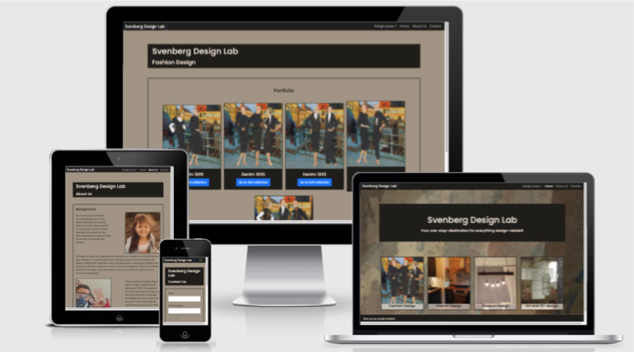

[Click here to view the website](https://gurimarie.github.io/Milestone-1-Svenberg-Design-Lab/)

## User Experience (UX)

### User stories:

### First time visitor goals
To find information about a company I'm curious about. To see their projects and their style. To confirm the quality and trustworthyness of the company.

### Returning visitor goals
To be able to find the project I'm looking for quicly. Perhaps look at different projects and different design-areas than on my first visit. Get a feel for the company as a whole.

### Frequent user goals
To be able to find the project I'm looking for quicly, and to be able to see all projects in each design-area on one page, in order to compare and find what is interesting.

### Site owner goals
To show prospective customers and partners what we do, our style and our high quality. As we work in several different design-areas, it is important that the visitor understands that they are at the right company-site regardless of what area they first have come in contact with. Therefore the different ares must be shown as equals, and not (for instance) primarily interior-design, and the other areas as additions. 
Another important reason behind the site is simply to collect and showcase previous project in one coherent space. 

## Design

### Colour scheme:

(Colour-scheme made in Word)
 
The colour-palett has been chosen to reflect the general mood of the company's projects.
Both as a good back-drop to showcase the previous projects of the company, but also to set the potential customer in the right mood and right away give them a feel for whether Svenberg Design Lab is the right company for them.
The colours are a mix between the traditional and the more modern, whith a heavy emphasis on the "cold neutral beiges and a dark brown, that is almost black. 

 
 
### Typography:
Font Poppins for headlines (h1-h5) and Open Sans for other text.  
 
Poppins is a straight-forward, easily-approachable font, that is both elegant and simple, and that has rounded shapes that makes it feel trustworthy. We want a font that is elegant, but not old-fashioned, and not too avant-guard. Poppins is just the right mix.  
 
Open Sans works well with Poppins, as it has much of the same overall feeling, a simple, nicely spaced look (not too narrow), and with lovely old-fashioned g's that gives it a nice, comforting feeling.

### Imagery:

At the time of deployment, all the images on this website are property of Svenberg Design Lab. 

## Wireframes

Home:
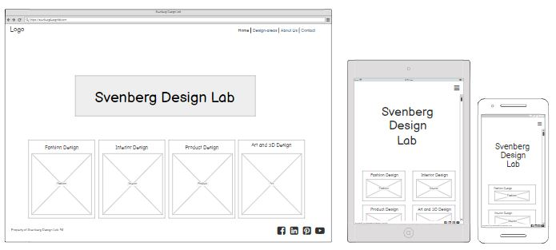

Navbar with dropdown:
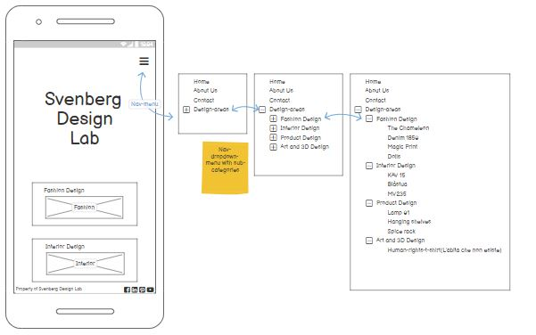

About Us:
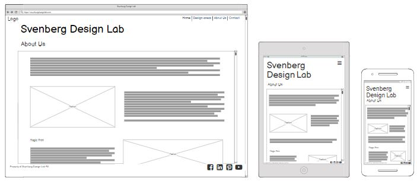

Contact:
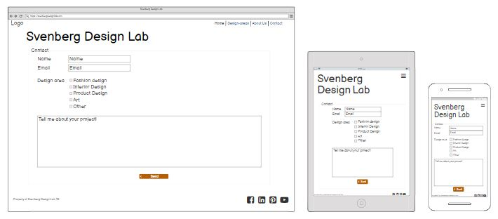

Fashion portfolio:
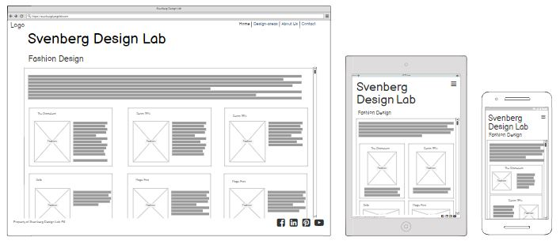

## Features

### Home:
Responsive navigation with nested dropdowns.
Link back to home from all pages using the "logo"
A sample-picture of each of the three design-categories the company is engaged in. The text on each category-image has a link to the portfolio-page for that category. Currently only the Fashion-portfolio-page has been made, so the html for Fashion-portfolio has been kopied to the other pages. The headlines are different, but all the projects are copies of the same two fashion-projects. Re-sizing and organizing those immages is outside the scope of this project.
The page concludes with a footer-element, with links to social media (only main-page, not company-specific), a link to the contact-page (for devices over size "large and above" (specifically dimensions ≥992px).

### Navbar:
Responsive navbar for easy navigation from page to page without having to go back. Dropdown-menu for the 4 main design-areas, and also sub-dropdown.menus down to each collection, for fast and efficient moving, if you know where you want to go aldready. Also includes a link to the Home-page in the "logo" (Brand-name) on the left of the nav-bar.

### About Us:
Backgroundinfo. No special features.

### Contact Us:
Form to submit a collaboration- or customer-request.
Had a spinner, but the html-validater did not approve.
Opens tu a new page, with sorry, this page has not been made yet.

### Fashion portfolio:
The Fashion-design-portfolio-page, will show a representativ photo from each collection/project, and will contain a link to the page that holds the complete collection. The portfolio-page will thereby be a place to get a quick glance at all the projects, and decide on which ones to go into in more detail.

#### Features to add in the future:
- Feedback from previous customers
- Search-button with the possibility to search for project-keywords within the website.
- Pages dedicated to each portfolio-collection/project in all categories.
- Fix images, good quality, but as small and easy-loadable as possible
- The contact-form is well fitted to smaller devices, but on large monitors there is no need for the input-fields to stretch across the whole page... The project has initially been mobile-first-oriented (as it should). Going forward, I would like to develop and beautify the layout on larger monitors, espesially for contact.html and about-us.html.   
- Make the cards on fashion-portfolio the same height.

## Issues overcome

- Major problem with nav-dropdown, turned out to be faulty links to Bootstral Javascript. Lots of work for nothing. Next time, wil check the HTML and CSS-validators first.

- Difficulty with aligning og inline-boxes. Soved with flexboxes.
- As someone who is new to coding, almost everything is an issue to overcome at this point, but I have relyed heavily on going back to our school-projects, going through the processes again, and that has helped tremendously.

## Technology used
### Programming languages:
- HTML5
- CSS3
- Bootstrap (JavaScript)

### Frameworks, libraries and programs:
- Bootstrap, to make the website responsive
- Google Fonts
- Font-awsome
- Flex-bokses
- Grid-system
- Balsamiq for wireframe-images, and planning of the layout
- Am I Responsive? used to create a mockup for the website on different devices (first picure in this readme)
- Github for storing the project
- Git for version-control
- Visual Studio Code for coding

## Testing

### Validation:

#### HTML-validator 
https://validator.w3.org/
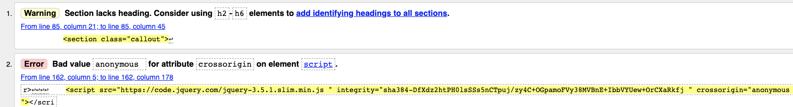
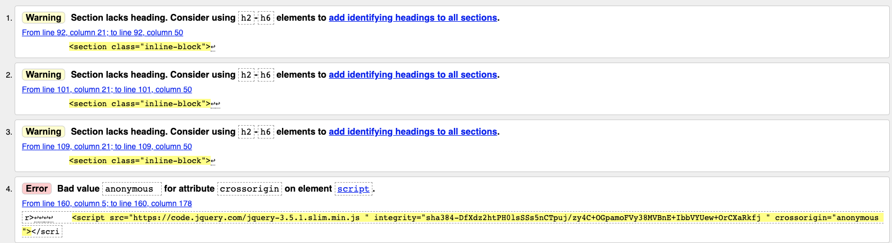

I sent each html-page through the HTML-validator, and these are the issues that came up initially.
The validator found some problems, and they were about two issues; one about my improper/overuse of section-elements, and one regarding the jquery-link to Bootstrap, which turned out to be the reason why my dropdown-nav-menus stopped working. Both issues have been solved, and files re-testet to be sure there are no other issues.

#### CSS-validator

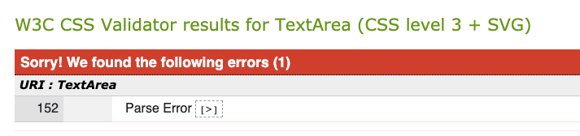

The CSS-validator helped me a lot, by pointing out an incorrect attempt to target the child of another element. I thought my solution did not work, but after correcting the error the CSS-validator alerted me to, the solution worked perfectly! And the validator was happy too :)
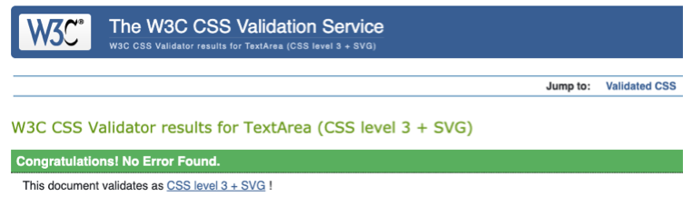

### Testing for user stories in UX-section:
When I come to the website as a new customer, I immediately se 4 picures that represents the 4 design-areas, and I can click the link under the picture to go to the are I want to study further. Also whith the dropdown-menu and sub-menu, I get a clear picture of how the website is structures, and where I can find what info. 

### Further testing:
All internal links hav been tested and re-tested and cross-checked again and again. There are many internal links here, espescially because the site is set up to become much bigger (more pages) than what is there now, and the links are already set up.

### Fixed bugs:

#### Navbar dropdown-issues

- Nav-dropdown part 1: No drop-down-list under each design-heading in nav-bar.
- Fix: Made correction from "data-toggle" to "data-bs-toggle" as an attribute of the a-element that is the parent of the nested list, and the sublists now function. Has been fixed with info from https://getbootstrap.com/docs/5.0/components/navbar/
- Addition: The bootstrap-docs use ul-element and li-elements also in the nested lists (here under Fashion Design, Interior Design etc.) but it seems to work fine with ul-element and li-elements for the main nav-bar-list and just div (class: dropdown-menu) + a (class: dropdown-item) in the sublist. At first I kept fashion and interior with ul/li, and product and art with div/a, and it did seem to work both ways, but I decided to go with ul/li in all sub-lists as well, as it seems more orderly and more semantically correct. 

- Nav-dropdown part 2: Each design-heading shows up separately in the nav-bar, instead of as categories in a dropdown-menu under Design-areas.
- Fix: Partially fixed through trial-and-error by comparisons with previously used nav-dropdowns and nested lists in the course-material, and with searches on nav-elements and lists in the Bootstrap-documentation. I finally simplified the whole nested list to the bare minimum, and started to work my way up. The nested list is now in order, but it does not collaps, so that will be part 3 of this navbar-dropdown-fixing.

- Nav-dropdown part 3: After the fix part 2, the dropdown-menu is now situated under the Design-areas-nav-heading, but it does not collapse.
- Fix: I went back through the bootstrap-documentation from Nav-dropdown-bug part 1 (https://getbootstrap.com/docs/5.0/components/navbar/), and after correcting some missing dropdown-classes and adding id to the top category, the nav-dropdown now is loaded in as it should be, with the top subject (Design-areas) on the nav-bar, and a dropdown-menu.

- Nav-dropdown part 4: The dropdown-box has white background, and the text is white (because of dark nav-bar), so the text is invisible.
- Fix: Simply add class .dropdown-menu-dark to the ul that holds the dropdown-menu. I found the information here: https://getbootstrap.com/docs/5.0/components/dropdowns/#dark-dropdowns

- Nav-dropdown part 5: The categories in the nav-dropdown do not collapse. Ideally the dropdown should open with only the 4 design-areas visible, and the sub-categories should only be visible after clicking the dropdown-toggle. 
- Fix: Finally solved mainly with two css-rules with help from https://bootstrap-menu.com/detail-multilevel.html! Hiding the subcategories until the mouse hovers over the parent-category, and then displaying them on the side, so as to not cover or hide other the parent-list. The ul-elements of the sub-lists also needed the addition of the attribute aria-labelled-by the id of their parent-category and all the classes that the ul-elements of the main-list had, pluss an additional class sub-dropdown, that is used to aim the css-rules.
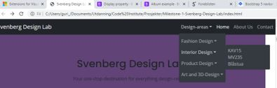

#### Alignment-issues

 - Alignment-problem with inline-blocks on frontpage (the 4 design-areas).
 - Fix: I gave the surrounding div-container the class of "d-flex", to use the bootstrap flex-box-classes to align and evenly distribute the inline-boxes. I found information about this on: https://getbootstrap.com/docs/5.0/utilities/flex/". It worked so well, so I also used it for the footer.

 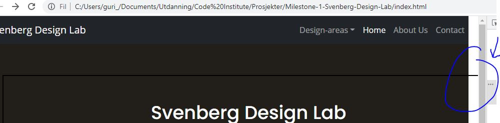
 - Problem with white space (the div's not streaching over the full viewport-area). 
 - Fix: I previously had div-elements with container-fluid-class and thought that should stretch the whole way, but looking at the "Whiskey-drop"-project I saw row and col-12 used for that purpose, so with a little bit of experimenting, I found the right combination. 

#### Problem with links to bootstrap (Jquery)
- I could not find the right link on getbootstrap.com -Documents, so I ended up copying the link from our school-project "Whiskey drop". It may be an older version, but the Chrome developer-tool (inspect) gives its "OK" (status 200).

### Unfixed bugs:

- Nav-dropdown part 5: The Nav-drop-down is again not working. Not dropping down at all. Need to go through old commits, and see when it last worked, and what has been changed afterwards.

 - Problem: The footer is migrating up on the page when there is not enough content to push it down.
 - Fix: adding a margin-top of -50px and ............? Need more work...
 I found the info here: https://css-tricks.com/couple-takes-sticky-footer/

- There is still a question regarding the categories in the nav-dropdown, when used on a small or medium device, the nav-bar is collapsed, and the user has to click fashion-design-link to open the subcategory beneath. But as the link is then pressed, the sub-list regarding the fact that both the 4 main-categories and the sub-categories are links to other pages. As the other pages are not yet 

- The inline-blocks on the frontpage (the 4 design-areas) align nicely now on larger displays with the d-flex-class on the parent-container, but they do not adjust well to smaller displays. More work required.

- Spinner on sendbutton on Contact-page spins as soon as it's hovered. Should be an indication that it is working (after customer has clicked the button)

## Deployment

### Github pages:
The project is deployed through GitHub Pages, by signing in to Github, opening the project-repository, going to settings, and selecting GitHub Pages on the settings-page. Under "Source, I chose the Master breanch, and GitHub started working on the deployment. The website was ready to be viewed almost immediately. 

## Credits

### Code:

- https://github.com/PaulFrankling/discover-north-yorks used as a template for structure and what to include in the README.
- Code Institute courses for everything
- getBootstrap documentation has also been used heavily.

